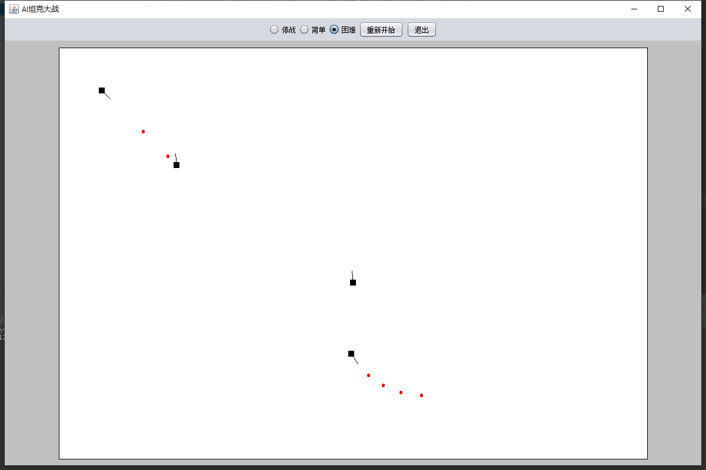

Functional Programming For Game dev with Monad
============================================

 

## 画图

使用Java2D构建所有元素.

## 添加事件

## 构建地图

在此之前，摒弃以往的编程思想。一切都是“函数”。

(坦克大战)

## Tank Game

A Free Monads to drive the AIs of the tanks. Each Tank holds a `Free[TankMove, Unit]`(aka AI[Unit]), which gets consumed one instruction at a time per game frame.

The "game" consists of a number of tanks with hard-wired AI scripts; there is no user input.

There are two interpreters, a Hard Interpreter, and an EAsy interpreter which shoots slightly to the right.

